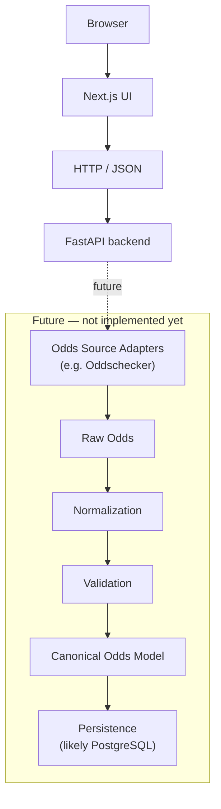

# Architecture

## Current state (MVP scaffold)



Only the `Browser → Next.js UI → HTTP/JSON → FastAPI` path exists today.
Everything in the `future` box is documented intent, not code.

## Future pipeline shape

Once odds collection work begins (out of scope for this task), the backend
is expected to grow roughly along these lines:

```
Source Adapter → Raw Odds → Normalization → Validation
              → Canonical Odds Model → REST API → Consumers
```

Consumers are expected to eventually include this project's own Next.js
UI, Hermes_FPL, and possibly future fixture-prediction or betting-analysis
tools. None of these integrations exist yet.

## Why this shape

- **Next.js talks to FastAPI over plain HTTP/JSON.** No shared code, no
  RPC framework, no GraphQL — the simplest thing that lets two independent
  processes in two different languages communicate.
- **API versioning from day one (`/api/v1/...`).** Costs nothing now and
  avoids an awkward migration later once real consumers (including
  Hermes_FPL) depend on specific response shapes.
- **No database yet.** There is no data to persist yet — only a health
  check. Adding a database now would be speculative.

## Database recommendation (not implemented)

Once odds history/persistence is needed, **PostgreSQL** is the recommended
choice:

- Free and open-source, runs locally with zero additional cost.
- Well-supported by both FastAPI (via SQLAlchemy or SQLModel) and typical
  hosting options if this service is ever deployed.
- Odds data is naturally relational (fixture → bookmaker → market →
  outcome → price-over-time), which suits a relational database better
  than a document or key-value store.
- No need for anything more exotic (time-series DB, Redis, etc.) at
  MVP scale — a normal Postgres table with a timestamp column is enough
  to start tracking odds history.

This is a recommendation for a future task, not a decision to act on now.

## Explicitly out of scope for this task

- Oddschecker or any other scraping/adapter implementation.
- Odds normalization or canonical data model.
- Any database or persistence layer.
- Hermes_FPL integration.
- Authentication/authorization (no sensitive data exists yet).
- Deployment/infrastructure (Docker, CI/CD, hosting).
